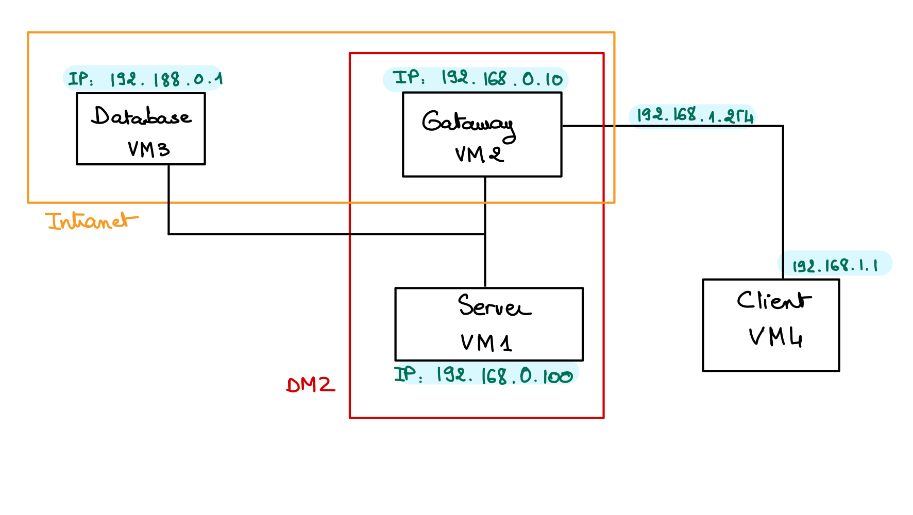
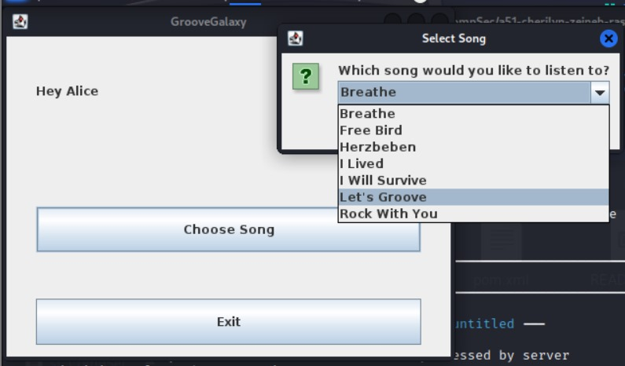
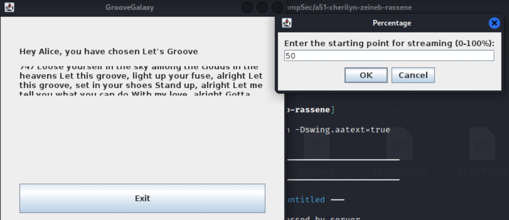

# C51 GrooveGalaxy Project ReadMe

<!-- this is an instruction line; after you follow the instruction, delete the corresponding line. Do the same for all instruction lines! -->

## Team

| Number | Name              | User                             | E-mail                              |
| -------|-------------------|----------------------------------| ------------------------------------|
| 108795 | Rassene M'sadaa   | <https://github.com/Enessar>   | <mailto:rassene.msadaa@tecnico.ulisboa.pt>   |
| 108780  | Cherilyn Christen     | <https://github.com/Cherie000>     | <mailto:cherilyn.christen@epfl.ch>     |
| 108825 | Zeineb Mellouli   | <https://github.com/zaynebmellouli> | <mailto:zeineb.mellouli@epfl.ch> |

  

*(add face photos with 150px height; faces should have similar size and framing)*

## Introduction

GrooveGalaxy is an online music store that sells songs in a custom format.
GrooveGalaxy allows users to search and browse through a wide range of songs, artists, and genres. The ability to preview songs is particularly helpful, ensuring that consumers only purchase music that resonates with them. Once they decide to buy, the process is seamless, offering choices in file formats like MP3, suitable for various devices.
GrooveGalaxy offers a personal account feature, enabling users to manage their purchases and preferences. It even tailors music recommendations based on listening history. This store effectively caters to the needs of music lovers, combining convenience, variety, and personalization.

## Contents

This repository contains documentation and source code for the *Network and Computer Security (SIRS)* project.

The [REPORT](REPORT.md) document provides a detailed overview of the key technical decisions and various components of the implemented project.
It offers insights into the rationale behind these choices, the project's architecture, and the impact of these decisions on the overall functionality and performance of the system.

This document presents installation and demonstration instructions.

*(adapt all of the following to your project, changing to the specific Linux distributions, programming languages, libraries, etc)*

## Requirements 
* Apache-maven 3.9.5: build automation tool for Java projects
* Java Development Kit 17 (JDK 17)
* PostgreSQL version 16
* JUnit: unit testing framework for Java programming language

## Installation

To see the project in action, it is necessary to setup a virtual environment, with 2 networks and 4 machines.  

All machines will be running on Kali Linux and configured according to the following figure and table:


## Getting started 

### JDK 17
Run this commands to install the JDK17
```sh
sudo apt install openjdk-17-jdk
```
Set JAVA_HOME at ~/.bashrc:
```sh
export JAVA_HOME=/lib/jvm/java-17-openjdk-amd64
export PATH=$JAVA_HOME/bin:$PATH
```

### Maven 3.9.5 
Run this commands to install Maven
```sh
wget https://dlcdn.apache.org/maven/maven-3/3.9.5/binaries/apache-maven-3.9.5-bin.tar.gz
tar -xvf apache-maven-3.9.5-bin.tar.gz
mv apache-maven-3.9.5 /opt/
```
Set MAVEN_HOME at ~/.bashrc:
```sh
MAVEN_HOME='/opt/apache-maven-3.9.5'
export "$MAVEN_HOME/bin:$PATH"
```

### Setup Database
Run this commands to install postgreSQL and Choose the default port 5432
```sh
sudo apt-get update
sudo apt-get install postgresql postgresql-contrib
```
To enable remote access to the PostgreSQL database, you need to make changes to the PostgreSQL server configuration file postgresql.conf and the pg_hba.conf file.

**1. postgresql.conf**: 

Locate the file at first. Usually, it's placed here :

**Linux: /etc/postgresql/{version}/main/postgresql.conf**

Edit the postgresql.conf file and update the 'listen_addresses' parameter. By default, it might be set to localhost. Change it to listen on all addresses:
```sh
listen_addresses = '*'
```
**2. pg_hba.conf**:

The path is similar to postgresql.conf.
Add an entry to allow access from the VM in the same subnet. For example, to allow access from any IP address, add the following line to pg_hba.conf:
```sh
host    all             all             195.168.0.0/24               md5
```

**3. Restart PostgreSQL:**

After making these changes, restart the PostgreSQL server to apply the new configuration.
```sh
sudo service postgresql restart
```
Now, you can connect to postgreSQL. Please when setting up your postgres use the **username = postgres** and **password = postgres**. 
If you want to create another username and password, make sure to change it in the class DataBaseConnector.

Use the following command to connect to PostgreSQL:

```sh
sudo -i -u postgres;
```
```sh
psql -U postgres;
```
Now you should be in here `postgres#`.

Create a database named groovedb:
```sh
CREATE DATABASE groovedb;
```
Connect to the groovedb database:
```sh
\c groovedb;
```
Now once you are in the database, run the content of the file dbsetup.txt(copy-paste in the terminal): 
```sh
(-- Drop tables if they exist
DROP TABLE IF EXISTS media_content, media, users;
.
.
.
 FOREIGN KEY (title_content) REFERENCES media(title) ON DELETE CASCADE,
);
```
Now you should execute the class mainforpopulate in order to populate the database. You can do it directly on the VM of the
Database or on the VM of the server to ensure that the communication works. 

To do that just go to the folder of the project and run the following commands: 
```sh
mvn clean compile
```
```sh
mvn exec:java -Dexec.mainClass="proj.database.mainforpopulate"
```
### Prerequisites

All the virtual machines are based on: Linux 64-bit, Kali 2023.3  
You can follow the guidelines for the the whole setup here: https://github.com/tecnico-sec/Setup/
[Download](https://cdimage.kali.org/) and [install](https://github.com/tecnico-sec/Setup/blob/master/KaliSetup.md) a virtual machine of Kali Linux 2023.3.  

### Machine configurations

Inside each machine, use Git to obtain a copy of all the scripts and code.

```sh
git clone https://github.com/tecnico-sec/a51-cherilyn-zeineb-rassene.git
```

Next we have custom instructions for each machine.

#### Machine 1: **Server**

For **VM1 server**, the mapping with the network should be:
eth0 is connected to sw-1


For the configuration:
```sh
sudo ifconfig eth0 192.168.0.100/24 up
```

Now set VM2 as the default gateway for VM1  by doing this:

```sh
sudo ip route add default via 192.168.0.10   # on VM1
```


#### Machine 2: **Gateway**

For **VM2 Gateway**, the mapping with the network should be:
eth0 should be connected to sw-1;
eth1 should be connected to sw-2;
eth2 should be connected to the Internet;


For the configuration:

```sh
sudo ifconfig eth0 192.168.0.10/24 up
sudo ifconfig eth1  192.168.1.254/24
```


Activate IP forwarding with:
```sh
sudo sysctl net.ipv4.ip_forward=1   # on VM2
```

Confirm that the flag value was updated to 1:
```sh
sysctl net.ipv4.conf.all.forwarding
```

Also, setup forwarding rules in VM2:

```sh
sudo iptables -P FORWARD ACCEPT    # Defines default policy for FORWARD
sudo iptables -F FORWARD           # Flushes all the rules from chain FORWARD
```

If you need to give access to the NAT to the other VMs run the following commands in VM2 to have NAT do the source and destination mapping:
```sh
sudo iptables -t nat -F            # Flushes all the rules from table NAT
sudo iptables -t nat -A POSTROUTING  -o eth2 -j MASQUERADE    # Creates a source NAT on interface eth2
```

#### Machine 3:  **Database**

For **VM3 database**, the mapping with the network should be:
eth0 is connected to sw-1

For the configuration:

```sh
$ sudo ifconfig eth0 192.168.0.1/24 up
```

Now set VM2 as the default gateway for VM3 by doing this:

```sh
$ sudo ip route add default via 192.168.0.10   # on VM3
```

#### Machine 4: **Client**

For **VM4 client**, it is :
eth0 is connected to sw-2

For the configuration: 
```sh
$ sudo ifconfig eth0 192.168.1.1/24 up
```

Now set VM2 as the default gateway for VM4 by doing this:
```sh
$ sudo ip route add default via 192.168.1.254   # on VM4
```


**Make changes permanent**
The changes you made before will be lost once you perform a reboot of your machine. 
In order to make them permanent you have to edit the corresponding /etc/network/interfaces file.

### On VM1:
```sh
source /etc/network/interfaces.d/*
```

```sh
# The loopback network interface and sw-1 interface
auto lo eth0                    
iface lo inet loopback

# sw-1 interface
iface eth0 inet static          
        address 192.168.0.100
        netmask 255.255.255.0
        gateway 192.168.0.10
```

### On VM2:

```sh
source /etc/network/interfaces.d/*
```

```sh
# The loopback network interface, sw-1 interface and sw-2 interface
auto lo eth0 eth1               
iface lo inet loopback

# sw-1 interface
iface eth0 inet static         
        address 192.168.0.10
        netmask 255.255.255.0

# sw-2 interface
iface eth1 inet static          
        address 192.168.1.254
        netmask 255.255.255.0
```

### On VM3:

```sh
source /etc/network/interfaces.d/*
```

```sh
# The loopback network interface and sw-2 interface
auto lo eth0                    
iface lo inet loopback

# sw-1 interface
iface eth0 inet static          
        address 192.168.0.1
        netmask 255.255.255.0
        gateway 192.168.0.10
```


### On VM4:

```sh
source /etc/network/interfaces.d/*
```

```sh
# The loopback network interface and sw-2 interface
auto lo eth0                    
iface lo inet loopback

# sw-2 interface
iface eth0 inet static          
        address 192.168.1.1
        netmask 255.255.255.0
        gateway 192.168.1.254
```

You should also enable IP forwarding permanently on VM2. For that you need to edit **/etc/sysctl.conf** and uncomment the following line:
```sh
net.ipv4.ip_forward=1
```


To make the iptables rules persistent, in VM2 install (select "yes" to save the current rules):

```sh
$ sudo apt install iptables-persistent
```

To save the current rules again, do:

### FOR IPv4
```sh
$ sudo sh -c 'iptables-save > /etc/iptables/rules.v4'
```

### FOR IPv6
```sh
$ sudo sh -c 'ip6tables-save > /etc/iptables/rules.v6'
```

To test the four virtual machines, you could ping each machine to another.


## Demonstration

Now that all the networks and machines are up and running, we have implemented some features to our application.

**Progressive Streaming:**
- Music is streamed progressively and securely, allowing users to start listening
to the content before it's fully downloaded.
- Users can enjoy a seamless listening experience without waiting for the entire 
file to be downloaded. Achieving this using threads.



**User-Controlled Playback:**
- Users have control over when they start playing the music.


**Secure Mechanism**
We're using CTR in order to stream the music directly ciphered.

### Running the application:

First be sure that you compiled the project by running the following command in the project folder for one of the VMS:
```sh
mvn clean compile
```

To run the server application, you need to run the following commands in the VM of the server
from the project folder;

```sh
mvn exec:java -Dexec.mainClass="proj.Server"
```

To run the client application, you need to run the following commands in the VM of the client

```sh
mvn exec:java -Dexec.mainClass="proj.Client"
```

FFor this demonstration, we've pre-loaded the database with a selection of songs and user profiles. Our client is 
logged in as 'Alice'.

To successfully run the application, you need to select the track "Let's Groove." Additionally, you must specify a 
percentage value indicating the portion of the song you wish to listen to.

Please note: Selecting a track that Alice doesn't have access to, or failing to specify a percentage, will cause the
application to crash. This is because we haven't yet implemented exception handling, so in such cases, the application 
is designed to fail.

After the server completes streaming the selected music portion, it will reset to await a new client connection.

Once the client finishes listening to the music, you'll need to close and restart the application to choose and listen 
to another song.

## Additional Information

### Links to Used Tools and Libraries

- [Java 17](https://openjdk.java.net/)
- [Maven 3.9.5](https://maven.apache.org/)
- [PostgreSQL](https://www.postgresql.org/)

### License

This project is licensed under the MIT License - see the [LICENSE.txt](LICENSE.txt) for details.

*(switch to another license, or no license, as you see fit)*

----
END OF README
