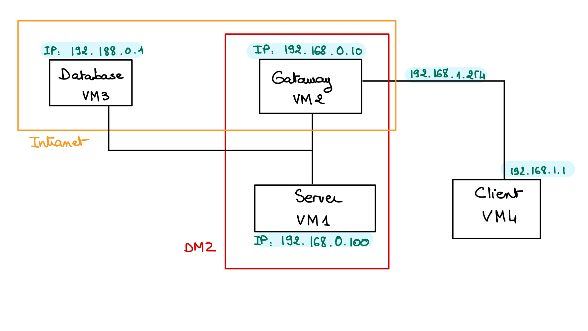

# C51 GrooveGalaxy Project ReadMe

<!-- this is an instruction line; after you follow the instruction, delete the corresponding line. Do the same for all instruction lines! -->

*(replace CXX above with group identifier, for proj, A07 ou T22)*

*(keep only your scenario name and delete the other names)*

## Team

| Number | Name              | User                             | E-mail                              |
| -------|-------------------|----------------------------------| ------------------------------------|
| 108795 | Rassene M'sadaa   | <https://github.com/Enessar>   | <mailto:rassene.msadaa@tecnico.ulisboa.pt>   |
| 108780  | Cherilyn Christen     | <https://github.com/Cherie000>     | <mailto:cherilyn.christen@epfl.ch>     |
| 108825 | Zeineb Mellouli   | <https://github.com/zaynebmellouli> | <mailto:zeineb.mellouli@epfl.ch> |

*(fill table above with team member information)*  

  

*(add face photos with 150px height; faces should have similar size and framing)*

## Introduction

GrooveGalaxy is an online music store that sells songs in a custom format.
GrooveGalaxy allows users to search and browse through a wide range of songs, artists, and genres. The ability to preview songs is particularly helpful, ensuring that consumers only purchase music that resonates with them. Once they decide to buy, the process is seamless, offering choices in file formats like MP3, suitable for various devices.
GrooveGalaxy offers a personal account feature, enabling users to manage their purchases and preferences. It even tailors music recommendations based on listening history. This store effectively caters to the needs of music lovers, combining convenience, variety, and personalization.

## Contents

This repository contains documentation and source code for the *Network and Computer Security (SIRS)* project.

The [REPORT](REPORT.md) document provides a detailed overview of the key technical decisions and various components of the implemented project.
It offers insights into the rationale behind these choices, the project's architecture, and the impact of these decisions on the overall functionality and performance of the system.

This document presents installation and demonstration instructions.

*(adapt all of the following to your project, changing to the specific Linux distributions, programming languages, libraries, etc)*

## Requirements 
* Apache-maven 3.9.5: build automation tool for Java projects
* Java Development Kit 17 (JDK 17)
* PostgreSQL version 16
* JUnit: unit testing framework for Java programming language

## Installation

To see the project in action, it is necessary to setup a virtual environment, with 2 networks and 4 machines.  

All machines will be running on Linux and configured according to the following figure and table:


## Getting started 

### JDK 17
Run this commands to install the JDK17
```sh
sudo apt install openjdk-17-jdk
```
Set JAVA_HOME at ~/.bashrc:
```sh
export JAVA_HOME=/lib/jvm/java-17-openjdk-amd64
export PATH=$JAVA_HOME/bin:$PATH
```

### Maven 3.9.5 
Run this commands to install Maven
```sh
wget https://dlcdn.apache.org/maven/maven-3/3.9.5/binaries/apache-maven-3.9.5-bin.tar.gz
tar -xvf apache-maven-3.9.5-bin.tar.gz
mv apache-maven-3.9.5 /opt/
```
Set MAVEN_HOME at ~/.bashrc:
```sh
MAVEN_HOME='/opt/apache-maven-3.9.5'
export "$MAVEN_HOME/bin:$PATH"
```

### Setup Database
Run this commands to install postgreSQL
```sh
sudo apt-get update
sudo apt-get install postgresql postgresql-contrib
```
To enable remote access to the PostgreSQL database, you need to make changes to the PostgreSQL server configuration file postgresql.conf and the pg_hba.conf file.

1. postgresql.conf: 
Locate the file at first. Usually, it's placed here :
Linux: /etc/postgresql/{version}/main/postgresql.conf
Edit the postgresql.conf file and update the 'listen_addresses' parameter. By default, it might be set to localhost. Change it to listen on all addresses:
```sh
listen_addresses = '*'
```
2. pg_hba.conf:
The path is similar to postgresql.conf.
Add an entry to allow access from your VM. For example, to allow access from any IP address, add the following line to pg_hba.conf:
```sh
host    all             all             0.0.0.0/0               md5
```

3. Restart PostgreSQL:
After making these changes, restart the PostgreSQL server to apply the new configuration.
```sh
sudo service postgresql restart
```
Now, you can connect to postgreSQL. Please when setting up your postgres usse the username = postgres and password = postgres. 
If you want to create another username and password, make sure to change it in the class DataBaseConnector
Use the following command to connect to PostgreSQL:
```sh
psql -U postgres;
```
Create a database named groovedb:
```sh
postgres# CREATE DATABASE groovedb;
```
Connect to the groovedb database:
```sh
\c groovedb;
```
Now once you are in the database, run the content of the file dbsetup.txt(copy-paste in the terminal): 
```sh
(-- Drop tables if they exist
DROP TABLE IF EXISTS media_content, media, users;
.
.
.
 FOREIGN KEY (title_content) REFERENCES media(title) ON DELETE CASCADE,
);
```
Now you should execute the class mainforpopulate in order to populate the database:(in another terminal)
```sh
mvn clean compile
```
```sh
mvn exec:java -Dexec.mainClass="proj.database.mainforpopulate"
```


### Prerequisites

All the virtual machines are based on: Linux 64-bit, Kali 2023.3  

[Download](https://...link_to_download_installation_media) and [install](https://...link_to_installation_instructions) a virtual machine of Kali Linux 2023.3.  
Clone the base machine to create the other machines.

*(above, replace witch actual links)*

### Machine configurations

For each machine, there is an initialization script with the machine name, with prefix `init-` and suffix `.sh`, that installs all the necessary packages and makes all required configurations in the a clean machine.

Inside each machine, use Git to obtain a copy of all the scripts and code.

```sh
$ git clone https://github.com/tecnico-sec/cxx...
```

*(above, replace with link to actual repository)*

Next we have custom instructions for each machine.

#### Machine 1

This machine runs ...

*(describe what kind of software runs on this machine, e.g. a database server (PostgreSQL 16.1))*

To verify:

```sh
$ setup command
```

*(replace with actual commands)*

To test:

```sh
$ test command
```

*(replace with actual commands)*

The expected results are ...

*(explain what is supposed to happen if all goes well)*

If you receive the following message ... then ...

*(explain how to fix some known problem)*

#### Machine ...

*(similar content structure as Machine 1)*

## Demonstration

Now that all the networks and machines are up and running, ...

*(give a tour of the best features of the application; add screenshots when relevant)*

```sh
$ demo command
```

*(replace with actual commands)*

*(IMPORTANT: show evidence of the security mechanisms in action; show message payloads, print relevant messages, perform simulated attacks to show the defenses in action, etc.)*

This concludes the demonstration.

## Additional Information

### Links to Used Tools and Libraries

- [Java 11.0.16.1](https://openjdk.java.net/)
- [Maven 3.9.5](https://maven.apache.org/)
- ...

### Versioning

We use [SemVer](http://semver.org/) for versioning.  

### License

This project is licensed under the MIT License - see the [LICENSE.txt](LICENSE.txt) for details.

*(switch to another license, or no license, as you see fit)*

----
END OF README
