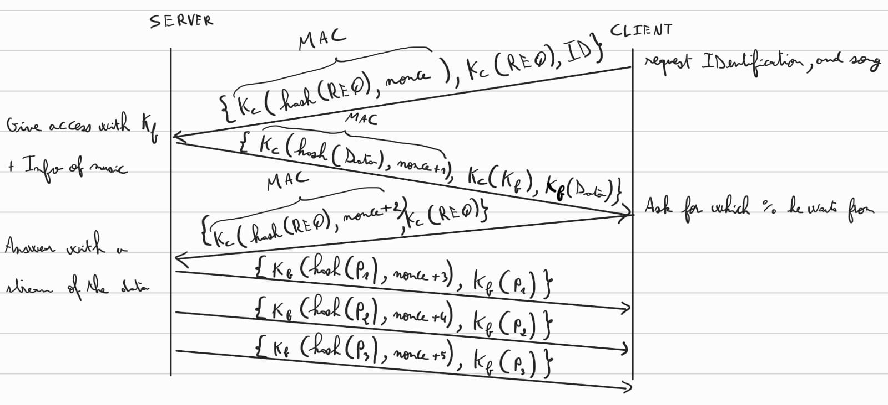

# C51 GrooveGalaxy Project Report

## 1. Introduction

(_Provide a brief overview of your project, including the business scenario and the main components: secure documents, infrastructure, and security challenge._)

(_Include a structural diagram, in UML or other standard notation._)

## 2. Project Development

### 2.1. Secure Document Format

#### 2.1.1. Design

We will have secured communication between the client and the server. 

The server will have in his database the informations for each client. These informations are : the client's ID, the symmectric key of the client-server, the last nonce used nonce with the client and the symmetric Key of his family (each client is in a family that has a symmetric Key known by the server only and will be stored in his data base for each client the symmetric Key of his family, if the client doesn't have a family, he will be registered to a family of one).

The client will have the symmetric key of the client-server and his ID for the server.
#### Message architecture

There will be two set of (request, response) from the client to the server.
The first:
From client to server: ${K_c(hash(Req), nonce), K_c(Req), ID}$

The client will send a Req that will contain which song he wants with an ID and MAC of the request ${K_c(hash(Req), nonce)}$
The server will search in his database with the ID of the client for the sym Key $K_c$ that he shares with the client, and will be able to read the message and know it’s integrity.
From the server to the client: ${K_c(hash(Data), nonce + 1), K_c(K_f), K_f(Data)}$. 
The server will send first the info of the music in data and will wait to know from when the client want his music to be streamed.
The data will be encoded with the family key that the client belongs to ($K_f$) this key will be sent to the client by encoding it with their symmetric key ($K_c(K_f)$) and finally a MAC 
with the message to check for entegrity and freshness.
The client after decrypting the message will have access to his family sym Key ($K_f$).
The Second:
From client to server: ${K_c(hash(Req), nonce + 2), K_c(Req)}$
The client will indicate in request from which percentage he wants the music.
Encrypting the message with the sym Key ($K_c$) and a MAC to check for integrity and freshness. 
From server to client: ${K_f(hash(P_n), nonce + 3), K_f(P_n)}$
The server will stream each byte of the music from the pourcentage asked from the client, encrypted by the the family key. We add to this stream message a MAC for the entegrity and freshness.

#### Protect Method

For this method we will make use of the Java feature “method overloading” such that it can be used by both the server and the client. 
The standard method used by the client takes as input the message to be encrypted, the next nonce and the symmetric key of the client. The overloaded version will expect an additional parameter for the symmetric key of the client's family.
Both methods will return the encoded MAC and the encoded message. The overloaded method will additionally return the family key encrypted with the clients key Kc(Kf)

#### Unprotect Method
For the unprotect section, for both client and server, we need to decrypt at first the MAC received (MIC + freshness : MIC is composed of the hashed message encrypted with the symmetric key). This will ensure the integrity, authenticity and the freshness of the communication.
Secondly, we will make use of the Java feature “method overloading” such that it can be used by both the server and the client. The client will have to decrypt two messages:
-M1: the encrypted family key sent by the server 
-M2: once the client has the symmetric family key, he will be able to decrypt the second message with it (song).
For the server, he will have to decrypt only the request sent by the client using the symmetric shared key. 
Both functions(overloaded and standard) will return the decoded MAC and the decoded message. 

#### Check Method

This method will also be used by the server and the client. It takes as input the decoded MAC address, the decoded message and the previous nonce known by the machine.
Freshness: The method calculates the next nonce and checks that it corresponds to the one of the MAC 
Integrity: The method calculates the hash of the decoded message and checks that it corresponds to the one of the MAC too.
If both of these tests pass the method returns true, in any other case it returns false as the freshness, the authenticity or the integrity of the message is not given. 

#### 2.1.2. Implementation

(_Detail the implementation process, including the programming language and cryptographic libraries used._)

(_Include challenges faced and how they were overcome._)

For our project, we have selected Java as the programming language due to its robust security features and extensive libraries for cryptographic functions. The encryption scheme between the server and the client will utilize AES in CBC (Cipher Block Chaining) mode. This mode ensures that each block of plaintext is XORed with the previous ciphertext block before being encrypted, providing strong data encryption.

On the other hand, for encryption within family members, we will employ AES in CTR (Counter) mode. This choice is particularly well-suited for streaming data, as it allows for the encryption of data bytes individually, facilitating efficient processing of streaming content.

The nonce, a number used once, will be randomly generated at the start of the communication session. It will then be incremented by one for each subsequent message to ensure that each message is unique, mitigating the risk of replay attacks.

For hashing, we will implement the SHA-2 algorithm. Given that SHA-2 offers a high level of collision resistance, and our application will not reach the threshold where collisions become a practical concern, it is an appropriate choice for ensuring the integrity and authenticity of our messages

### 2.2. Infrastructure

#### 2.2.1. Network and Machine Setup

(_Provide a brief description of the built infrastructure._)

(_Justify the choice of technologies for each server._)

#### 2.2.2. Server Communication Security

(_Discuss how server communications were secured, including the secure channel solutions implemented and any challenges encountered._)

(_Explain what keys exist at the start and how are they distributed?_)

### 2.3. Security Challenge

#### 2.3.1. Challenge Overview

(_Describe the new requirements introduced in the security challenge and how they impacted your original design._)

#### 2.3.2. Attacker Model

(_Define who is fully trusted, partially trusted, or untrusted._)

(_Define how powerful the attacker is, with capabilities and limitations, i.e., what can he do and what he cannot do_)

#### 2.3.3. Solution Design and Implementation

(_Explain how your team redesigned and extended the solution to meet the security challenge, including key distribution and other security measures._)

(_Identify communication entities and the messages they exchange with a UML sequence or collaboration diagram._)  

## 3. Conclusion

(_State the main achievements of your work._)

(_Describe which requirements were satisfied, partially satisfied, or not satisfied; with a brief justification for each one._)

(_Identify possible enhancements in the future._)

(_Offer a concluding statement, emphasizing the value of the project experience._)

## 4. Bibliography

(_Present bibliographic references, with clickable links. Always include at least the authors, title, "where published", and year._)

----
END OF REPORT
