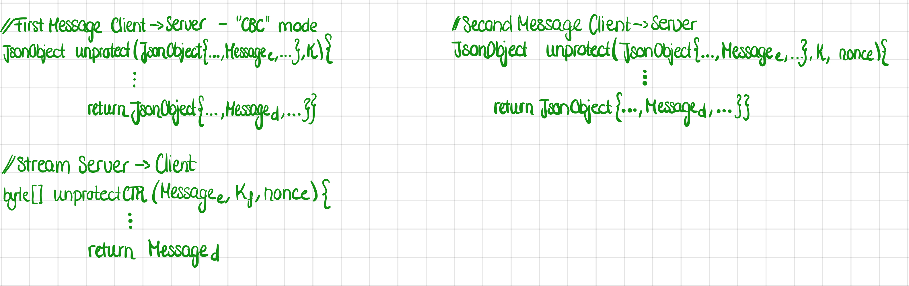
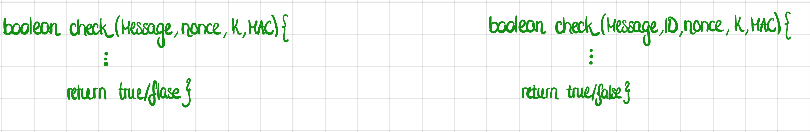

# C51 GrooveGalaxy Project Report

## 1. Introduction

In this project, we implemented the security infrastructure for an online music store. The core of this infrastructure is centered around secure communication and data protection, ensuring both confidentiality and integrity in the store's operations.
The infrastructure includes a gateway router equipped with a firewall, which acts as the first line of defense in protecting the internal network. The firewall monitors and controls incoming and outgoing network traffic based on predetermined security rules, thereby safeguarding the network against unauthorized access and various types of cyber threats.

The communication between the server and the client is established over an HTTPS connection. This setup ensures that the data exchanged between the user's device and the server is encrypted and secure from eavesdropping or tampering. HTTPS provides a layer of security that is essential for protecting sensitive user data, such as personal information and payment details. Depending on the nature of the message being transmitted, we use Advanced Encryption Standard (AES) encryption in either Cipher Block Chaining (CBC) or Counter (CTR) mode.
   
All the infromation about the song, the song itself and the symetric keys are stored in the database. The server communicates with the database using PostgreSQL, a robust and secure database management system. This choice ensures efficient handling of data with reliable performance and strong security features.

## 2. Project Development

### 2.1. Secure Document Format

#### 2.1.1. Design

There is AES secured communication between the client and the server. 
On the server side, a database maintains essential information about each client. This includes:

1. **Client's ID**: A unique identifier for each client.
2. **Client-Server Symmetric Key**: A key used for encrypting and decrypting the messages exchanged between the client and the server.
3. **Last Used Nonce**: The most recent nonce (number used once) employed in communication with the client.
4. **Family Symmetric Key**: Each client belongs to a 'family' group, which has its own symmetric key known only to the server. This key is stored in the server's database for each client. In cases where a client does not belong to an existing family, they are assigned to a single-member family, and the corresponding family key is managed accordingly.

On the client side, the following information is maintained:

1. **Client-Server Symmetric Key**: The client holds this key to facilitate secure communication with the server.
2. **Client's ID**: This identifier is used for interactions with the server, ensuring that the server can correctly recognize and authenticate the client.

#### Message architecture

There are two sets of messages from the client to the server.

The first:
From client to server: ${K_c(hash(Message, ID, nonce)), K_c(Message), Nonce, ID}$
The client sends a Message that contains which song he wants with an ID and MAC of the request ${K_c(hash(Message, ID, nonce))}$
The protect method run by the client returns a JSON file with four seperate properties for each element of the message.
By adding the ID to the hash we protect the ID from being tampered with. The ID is not ciphered as the server needs it to look up the key of the client sending the request. 
The server searches in his database with the ID for the client's symetric key $K_c$ and is able to read the message and check it's freshness, authenticity and integrity.

From the server to the client: ${K_c(hash(Data, nonce+1)), K_c(K_f), K_f(Data)}$. 
The server first sends the information of the music and it's lyrics and will wait to know from what percentage on the client wants his music to be streamed.
The data is encoded with the family key that the client belongs to ($K_f$). This key is sent to the client encoded with their symmetric key ($K_c(K_f)$) and finally a MAC 
with the message to check for integrity, authenticity and freshness.
After the client deciphered the message, he has access to his family's symetric key ($K_f$).

The Second:
From client to server: ${K_c(hash(Message, nonce + 2)), K_c(Message)}$
The client will indicate in the request from which percentage he wants the music.
Encrypting the message with the symetrc key ($K_c$) and a MAC to check for integrity, authenticity and freshness. 

NOT YET DETERMINED
From server to client: ${K_f(hash(P_n), nonce + 3), K_f(P_n)}$
The server will stream a block of bytes of the music from the percentage requested by the client, encrypted by the the family key. We add to this stream message a MAC for integrity, authenticity and freshness. 
NOT YET DETERMINED

#### Protect Method

For this method we will make use of the Java feature “method overloading” such that it can be used by both the server and the client. 
The standard method used by the client takes as input the message to be encrypted, the next nonce and the symmetric key of the client. 
(When identifying himself in the first message the client concatinates the request and the ID to form a single message, encrypting that with the protect method and then adding the uncyphered ID to the output before sending the message) 
The overloaded version will expect an additional parameter for the symmetric key of the client's family.
Both methods will return the encoded MAC and the encoded message. The overloaded method will additionally return the family key encrypted with the clients key Kc(Kf)

#### Unprotect Method
For the unprotect method, used by both the client and the server, we need to decrypt at first the MAC received (MIC + freshness : MIC is composed of the hashed message encrypted with the symmetric key). This will ensure the integrity, authenticity and the freshness of the communication.
We will make use of the Java feature “method overloading” such that it can be used by both the server and the client. 
The client will have to decrypt two messages:
-M1: the encrypted family key sent by the server 
-M2: once the client has the symmetric family key, he will be able to decrypt the second message with it (song).

The server, he will have to decrypt only the request sent by the client using the symmetric shared key. When decoding the first request of the client he will first seperate the unciphered ID from the MAC and the ciphered Message. Then he will run the unprotect message on the encoded MAC address, the encoded Message and the ID. In this specific case of the identification the $Message_d$ and $Message_e$ corresponds to the concatination of the inital request and the client's ID. The ID is also hash into the MAC to ensure it's protection.
Both functions(overloaded and standard) will return the decoded MAC and the decoded message. 

#### Check Method

This method will also be used by the server and the client. It takes as input the decoded MAC address, the decoded message and the previous nonce known by the machine.
The method calculates the hash of the message and the next nonce. It then checks that this corresponds to the decoded MAC given as input. 
If this test passes the method returns true, in any other case it returns false as the freshness, the authenticity or the integrity of the message is not given. 

#### 2.1.2. Implementation

(_Detail the implementation process, including the programming language and cryptographic libraries used._)

(_Include challenges faced and how they were overcome._)

For our project, we have selected Java as the programming language due to its robust security features and extensive libraries for cryptographic functions. The encryption scheme between the server and the client will utilize AES in CBC (Cipher Block Chaining) mode. This mode ensures that each block of plaintext is XORed with the previous ciphertext block before being encrypted, providing strong data encryption.

On the other hand, for encryption within family members, we will employ AES in CTR (Counter) mode. This choice is particularly well-suited for streaming data, as it allows for the encryption of data bytes individually, facilitating efficient processing of streaming content. We faced a challenge in generating the MAC address for the streamed package rather than the data as a whole. We decided to compute the MAC on the encrypted package to ensure the integrity, authenticity and the freshness of each of the streamed pack of bytes.

The nonce, a number used once, will be randomly generated at the start of the communication session. It will then be incremented by one for each subsequent message to ensure that each message is unique, mitigating the risk of replay attacks.

For hashing, we will implement the SHA-2 algorithm. Given that SHA-2 offers a high level of collision resistance, and our application will not reach the threshold where collisions become a practical concern, it is an appropriate choice for ensuring the integrity and authenticity of our messages

### 2.2. Infrastructure

#### 2.2.1. Network and Machine Setup

(_Provide a brief description of the built infrastructure._)

(_Justify the choice of technologies for each server._)

1. **Client Machine**: 
   - **Description**: The Client Machine serves as the user's interface for interacting with GrooveGalaxy. It provides a user-friendly GUI through which users can receive song information and stream music.
   - **Technology Justification**: 
         - HTTPS Connection: The use of HTTPS (Hypertext Transfer Protocol Secure) for client-server communication is crucial for ensuring the confidentiality and integrity of the data               transmitted. HTTPS encrypts the data sent between the client and the server, protecting information from eavesdropping and man-in-the-middle attacks. 
         - AES in CBC and CTR Modes:
               - CBC (Cipher Block Chaining) Mode: AES in CBC mode is employed for scenarios where data integrity is as crucial as confidentiality. CBC mode ensures that each block of                      ciphertext depends on all preceding plaintext blocks, providing strong data protection.
               - CTR (Counter) Mode: AES in CTR mode is used for streaming audio content because it allows for random access to encrypted data. This means users can start playback from                     any part of the stream without needing to decrypt the entire file first, enhancing the user experience with quick and efficient access to music.
     
2. **Server Machine**:
   - **Description**: This server handles requests from clients. It also has access to user accounts and key accesses through the connection to the database.
   - **Technology Justification**: The connection between the database and the server is managed automatically by the JDBC Driver. It acts as a bridge between the Java application and the database, allowing them to communicate and exchange data.

3. **Database Machine**:  HELP HELP HELP
   - **Description**: This machine is dedicated to storing and managing data. In our database schema, we created --- The media content will store the lyrics and the path_file.
   - **Technology Justification**:PostgreSQL is selected as the RDBMS for its open-source nature, reliability, and extensibility. 

4. **Gateway/Router Machine (e.g., VM2)**:
   - **Description**: This machine acts as a gateway or router, managing the traffic between the internet and the internal network. It also enforces firewall rules and monitors for unauthorized access.
   - **Technology Justification**: The gateway/router is equipped with firewall capabilities. It's crucial for this machine to have robust security configurations to protect against external threats. 

**Security Considerations**:
- **SSL/TLS**: Secure Socket Layer (SSL) and Transport Layer Security (TLS) protocols are essential for encrypting data in transit between the client, server, and database machines, protecting against eavesdropping and man-in-the-middle attacks.
- **Firewall Rules**: The gateway/router should have strict firewall rules to control incoming and outgoing network traffic, only allowing authorized communications and protecting against network-based attacks.
- **Data Encryption**: Encryption of the data ensures the integrity, authenticity and the freshness of the communication.

#### 2.2.2. Server Communication Security

(_Discuss how server communications were secured, including the secure channel solutions implemented and any challenges encountered._)

In the GrooveGalaxy infrastructure, server communications are secured through a combination of HTTPs (using SSL/TLS) and AES encryption. 

1. **HTTPS (Hypertext Transfer Protocol Secure)**: This is an extension of the Hypertext Transfer Protocol (HTTP). It is used for secure communication over a computer network and is widely used on the Internet. HTTPS incorporates SSL/TLS to encrypt the HTTP requests and responses, thereby securing the transfer of data between the client and the server on the application layer. 

2. **SSL/TLS (Secure Sockets Layer/Transport Layer Security)**: SSL and TLS are cryptographic protocols that provide secure communication over a network. 

3. **AES (Advanced Encryption Standard)**: AES is a symmetric key encryption algorithm. We use it in CTR (Counter) mode to encrypt individual blocks of data independently. This mode is particularly useful for encrypting data that needs to be accessed randomly because it allows specific portions of the encrypted data to be decrypted independently of the rest. In our system, AES in CTR mode is used for encrypting the messages sent from the server to the client containing audio streams.
We use AES in CBC (Cipher Block Chaining) mode for all other communication between the server and the client. CBC mode is a method of encrypting data that turns a block cipher into a chain-dependent cipher. This means that each block of ciphertext depends on all preceding plaintext blocks which adds an additional layer of security because identical blocks of plaintext will not result in identical blocks of ciphertext.

(_Explain what keys exist at the start and how are they distributed?_)

Key management in the GrooveGalaxy infrastructure begins with the generation of SSL/TLS keys for the server, which are automatically generated by the HTTPS library in Java. This automation simplifies the process of key generation and ensures that the keys are created following best practices for security. During the SSL/TLS handshake process, the server's public key certificate, derived from these automatically generated keys, is shared with clients to establish a secure connection.
For the encryption of data, symmetric keys are used. These keys are generated and distributed in advance, ensuring that they are in place before they are needed for encryption and decryption processes. 

### 2.3. Security Challenge

#### 2.3.1. Challenge Overview

(_Describe the new requirements introduced in the security challenge and how they impacted your original design._)

The new requirements introduced in the security challenge significantly impact our original cryptographic design, necessitating both functional and architectural modifications. Firstly, the demand for quick playback initiation in the middle of an audio stream requires the implementation of a more flexible encryption scheme, such as symmetric key encryption with a mode that supports random access, like Counter (CTR) mode. This adaptation ensures that users can start playback from any point in the audio without needing to decrypt the entire file first. 
The CipherStream library in Java provides a convenient way to implement streaming encryption and decryption. The choice of symmetric encryption (e.g., AES) in a mode that supports random access, like CTR (Counter Mode), is essential here. This mode allows for decrypting any part of the stream independently, facilitating the quick start of playback.
Secondly, the concept of family sharing introduces a complex layer of key management where each family member must access the same encrypted content using their unique key. In this scenario, each family unit shares a common symmetric key that is used to encrypt the JSON files. However, since each user still has their own unique key,  a secure method to distribute the family key to each user is necessary. We do this by  using the individual client's keys to encrypt the family key before distributing it.

#### 2.3.2. Attacker Model
-nos buffers a un moment il faudra qu'on stop on envoie un "stop" un attackant peut venir 

(_Define who is fully trusted, partially trusted, or untrusted._)

(_Define how powerful the attacker is, with capabilities and limitations, i.e., what can he do and what he cannot do_)

#### 2.3.3. Solution Design and Implementation

(_Explain how your team redesigned and extended the solution to meet the security challenge, including key distribution and other security measures._)

(_Identify communication entities and the messages they exchange with a UML sequence or collaboration diagram._)  

## 3. Conclusion

(_State the main achievements of your work._)

(_Describe which requirements were satisfied, partially satisfied, or not satisfied; with a brief justification for each one._)

(_Identify possible enhancements in the future._)

(_Offer a concluding statement, emphasizing the value of the project experience._)

## 4. Bibliography

(_Present bibliographic references, with clickable links. Always include at least the authors, title, "where published", and year._)

----
END OF REPORT
